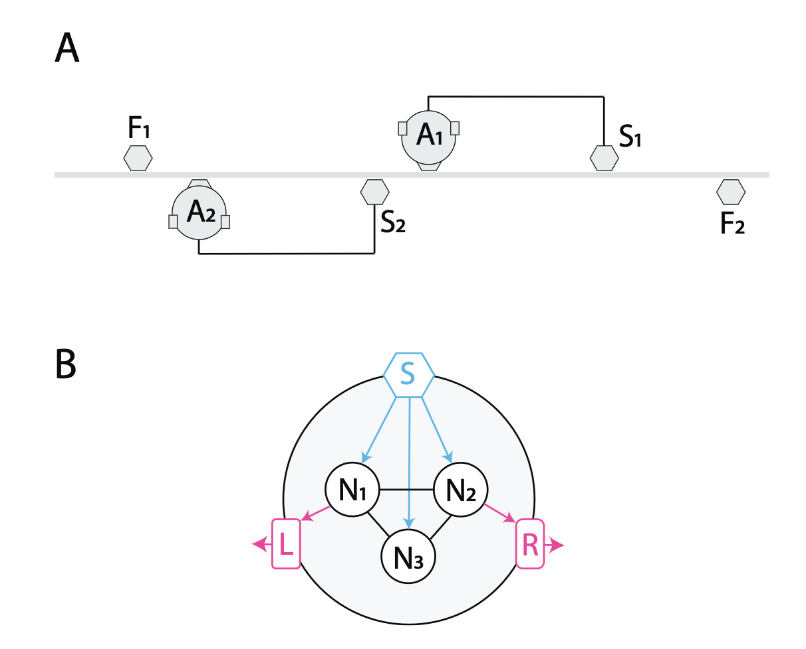

# Evolving Interaction

Analyzing the evolution of sensitivity to socially contingent interactions using a simulation of the Perceptual Crossing experiment. 

Original implementation written by [Eduardo Izquierdo](https://github.com/edizquierdo/PerceptualCrossing). 

(*A*) The task takes place in a 1-dimensional ring where two agents face each other. Each agent can sense the other's avatar (A), a shadow of the other's avatar (S), and a fixed object (F). 

(*B*) Each agent has a sensor (cyan) that can send information to all $N$ neurons (black). The neurons in the circuit are fully inter-connected, including self-connections (not depicted). The output from one neuron drives the left motor and another neuron drives the right motor (magenta). The neural circuits in the two agents are identical (i.e., they have the same parameters).

